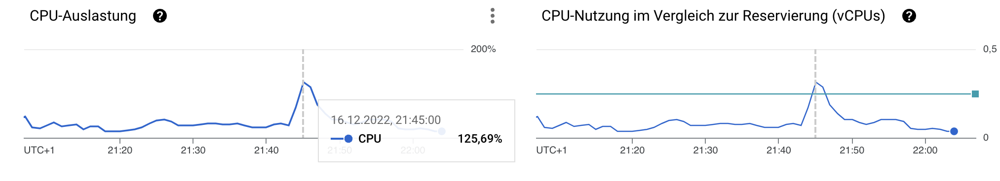
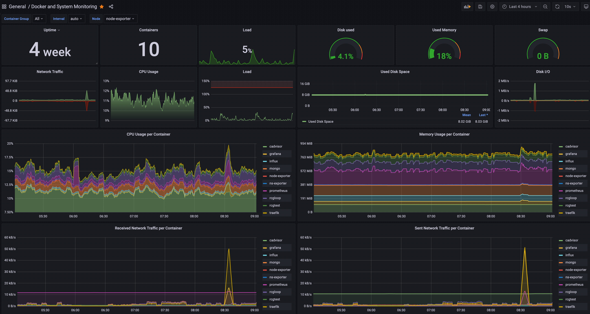
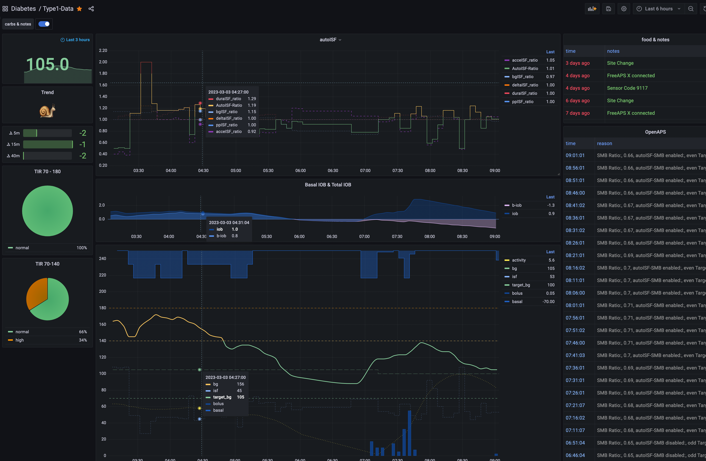

# ns-exporter
Nightscout exporter to InfluxDB

## Installation:
### 1. make the executable for ns-exprter

You need at least go version 1.17.
```
go build
```
You can test with `./ns-exporter`the output should be:
```
total treatments parsed:  0
total devicestatuses parsed:  0
total writen:  0
```

### 2. Create the Docker image
```
docker build -t ns-exporter .
```
or with M1/M2 Apple machine use
```
docker build --platform linux/amd64 -t ns-exporter .
```
I encountered an error lately on MacOSX with new Docker install:
```
ERROR: failed to solve: djpic/cron:standard: error getting credentials - err: exit status 1, out: ' '
```
which I was able to resolve with this [solution](https://github.com/docker/docker-credential-helpers/issues/60#issuecomment-1622539853)

test with
```
docker run -d ns-exporter:latest
```
### 3. Upload  Docker containerimage if neccesary

So the ns-exporter docker image should now be available on the local machine where you built it. If you did not do all above on a VM you have to upload the image to Docker hub.

```
 docker login
 docker tag ns-exporter:latest <yourDockerhubAccount>/ns-exporter:latest
 docker push <yourDockerhubAccount>/ns-exporter:latest
```

For FreeAPS-X and the reporting of autoISF-Ratios this commit is adjusted and a ns-exporter image is available at docker-hub with:
`image: mountrcg/ns-exporter:enacted90`
So with that you could skip the Create Docker image Step.

### 4. Deploy Docker containers

#### Grafana & Influx DB

You have to start with Grafana and Influx container as you have to configure the Influx DB and Grafana before you can deploy the ns-exporter container as it needs the token that you created on Influx DB.

So you can use [docker-compose.yml](https://github.com/mountrcg/ns-exporter/blob/master/docker-compose.yml) but you have to delete the service for ns-exporter in the first deployment.

Make sure not to forget the 2 volume specs, which are on the same level as the services for grafana and influx.

You can also look at [my ns-setup compose file](https://github.com/mountrcg/ns-exporter/blob/master/ns-setup/docker-compose.yml) and use the Grafana and Influx Service parts if you used  Justmaras ns-setup with traefik and so on. This is complete yml that puts 2 NS sites, 1 mongo, 1 traefik, 1 grafana, 1 Influx and 1 ns-exporter on one VM. When all is running without mistakes you can also push 3.000 entries (NS_EXPORTER_LIMIT=3000) from mongo to Influx (more than a week of data). However you will shortly push through the CPU ceiling of the E2 micro on GCC.



#### Configure Influx DB & Grafana

Thats the reason I gave Grafana and Influx a subdomain in FreeDNS, so that I can access the webinterfaces. The initial Login for Grafana is admin:admin. Influx is a little more user friendly to start it initially.

In current setup I have put Grafana and Inlux on the the same subdomain and used a 2nd traeffic websecure entry point for Influx website. So, one reaches Grafana at ports 80 and 443 , Influx can be reached at port 8443.

**In Influx DB you have to name the Bucket 'ns'.** You also have to create an API Token, which you need for Grafana to access the Influx DB and also as a paramater to deploy the ns-exporter Docker container.
Follow the [explanation to use Grafana with Influx DB](https://docs.influxdata.com/influxdb/v2.3/tools/grafana/?t=InfluxQL#view-and-create-influxdb-v1-authorizations), I use Flux as querry language.

In Grafana you can import the sample dashboard, that you can tweak: [grafana.json](https://github.com/mountrcg/ns-exporter/blob/master/grafana.json). Mine is in mg/dL, at Justmara's repo you find one in mmol/L.
I have also taken justmaras latest and adopted it for [FAX with additional variables](https://github.com/mountrcg/ns-exporter/blob/dev-autoISF/grafana-FAX.json), like rolling 24hr TDD and all autoISF adjustments (which I havent put in). But the ns-explorer build is adjusted to transfer all those to Influx.
If you want to make that all im mmol/l you will have to look at this [commit](https://github.com/mountrcg/ns-exporter/commit/e1b8355f6071843a48fd4266df81dfcfbe0c0b77) to re-integrate the calculation. Be aware lot of times people use `mmol/L * 18 = md/dL`. To be correct I would use `mmol/L / 0.0555 = mg/dL`.  Of course this all works only after the next step deploying the ns-exporter container.

I have also integrated a performance monitoring for linux based servers and docker containers, using the containers
* Prometheus
* node-exporter
* cadvisor

in the `docker-compose.yml`. The [dashboard file](https://github.com/mountrcg/ns-exporter/blob/dev-autoISF/grafana-PerformanceMonitor.json) can imported in Grafana the usual way. Of course this can be omitted/deleted.




#### ns-exporter Docker container config & deployment

So now you can configure the token for Influx DB in the ns-exporter variable in docker-compose.yml and deploy the last container. I did connect to mongo directly so did not configure the nightscout variables. You can check in Influx whether data is arriving, if all is fine it just takes a couple of seconds before the ns bucket fills with data. As said above you could use the image at Dockerhub if you are running FreeAPS-X `image: mountrcg/ns-exporter:enacted90`.



## Some Config topics

arguments:

	mongo-uri       - MongoDb uri to download from
	mongo-db        - MongoDb database name
	ns-uri          - Nightscout server url to download from
	ns-token        - Nigthscout server API Authorization Token
	limit           - number of records to read per request
	skip            - number of records to skip from beginning (`skip=100 take=50` means 'take records from 101 to 150')
	influx-uri      - InfluxDb uri to download from
	influx-token    - InfluxDb access token
	influx-org      - (optional, default = 'ns') InfluxDb organization to use
	influx-bucket   - (optional, default = 'ns') InfluxDb bucket to use
	influx-user-tag - (optional, default = 'unknown') InfluxDb 'user' tag value to be added to every record - to be able to store multiple users data in single bucket


arguments also can be provided via env with `NS_EXPORTER_` prefix:

	NS_EXPORTER_MONGO_URI=
	NS_EXPORTER_MONGO_DB=
	NS_EXPORTER_NS_URI=
	NS_EXPORTER_NS_TOKEN=
	NS_EXPORTER_LIMIT=
	NS_EXPORTER_SKIP=
	NS_EXPORTER_INFLUX_URI=
	NS_EXPORTER_INFLUX_TOKEN=
	NS_EXPORTER_INFLUX_ORG=
	NS_EXPORTER_INFLUX_BUCKET=
	NS_EXPORTER_INFLUX_USER_TAG=

So you can choose the data source: direct MongoDB or Nightscout REST API. Supplying required set of parameters will trigger related consumer.
You can even supply both and get from both sources :)

For NS API access you need provide security token. For security reason it is better to go to 'Admin tools' and create special token for NS-Exporter only instead of using admin security key.
Since exporter only requires read access, creating role with two permissions will be enough:
- api:treatments:read
- api:devicestatus:read

### Presentation

I'm using Grafana dashboard for viewing data. To setup grafana with InfluxDB you need to follow InfluxDB's [instructions](https://docs.influxdata.com/influxdb/v2.3/tools/grafana/).
The sample dashboard can be imported from `grafana.json`. It uses both InfluxQL and Flux datasources for different panels. Some can be omitted, some can be reworker based on other InfluxDB datasource query type.
Anyway they're provided as samples, for educational purpose :)
